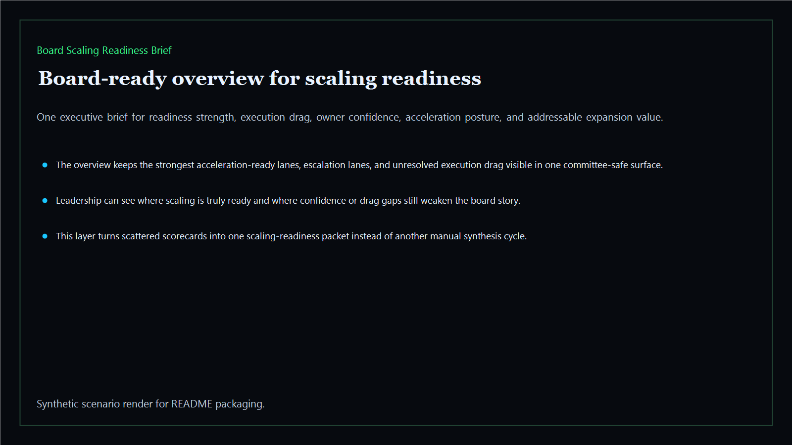
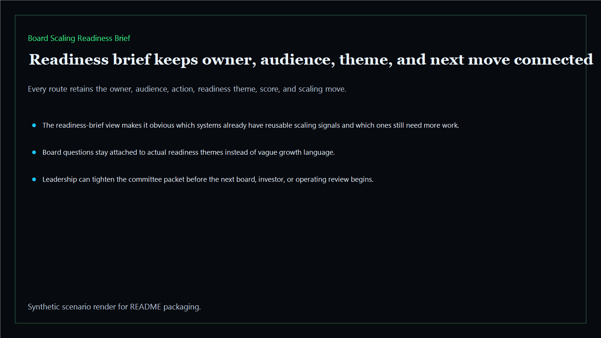
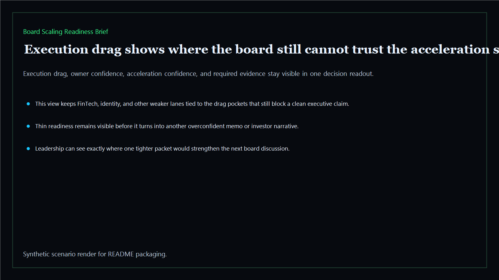
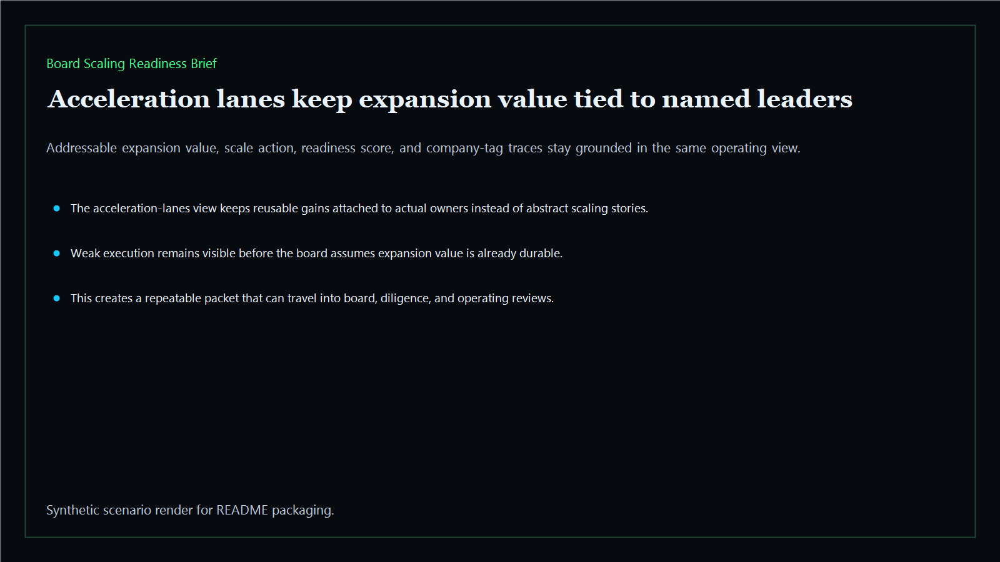

# Board Scaling Readiness Brief

Board-ready scaling readiness brief for expansion lanes, execution drag, ownership confidence, and board-safe acceleration decisions across the executive estate.

- Live: `https://scale.kineticgain.com/`
- Repo: `mizcausevic-dev/board-scaling-readiness-brief`

## Why this matters

Leaders need more than one abstract growth target. They need one readiness brief that shows which lanes can scale now, where execution drag still sits, which owners are ready to absorb more load, and where the board should slow acceleration until the operating base is stronger.

## What it includes

- TypeScript executive-intelligence surface for scaling readiness with modeled expansion signals, execution drag, ownership confidence, and board-safe acceleration posture
- synthetic executive lanes across AI, identity, revenue, FinTech, biotech, procurement, and public-sector readiness
- reusable outputs for readiness briefs, drag packets, acceleration views, and board-ready operating maps
- prerendered static site, JSON payloads, screenshots, and docs

## Routes

- `/`
- `/readiness-brief`
- `/execution-drag`
- `/acceleration-lanes`
- `/verification`
- `/docs`

## Local run

```bash
cd board-scaling-readiness-brief
npm install
npm run verify
npm run prerender
npm run render:assets
```

## CLI

```bash
npx board-scaling-readiness-brief fixtures/board-scaling-readiness-brief.json --format summary
npx board-scaling-readiness-brief fixtures/board-scaling-readiness-brief-clean.json --format json
```

## Docs

- [Architecture](docs/architecture.md)
- [Origin](docs/ORIGIN.md)
- [Kinetic Gain Embedded](docs/KINETIC_GAIN_EMBEDDED.md)

## Screenshots






